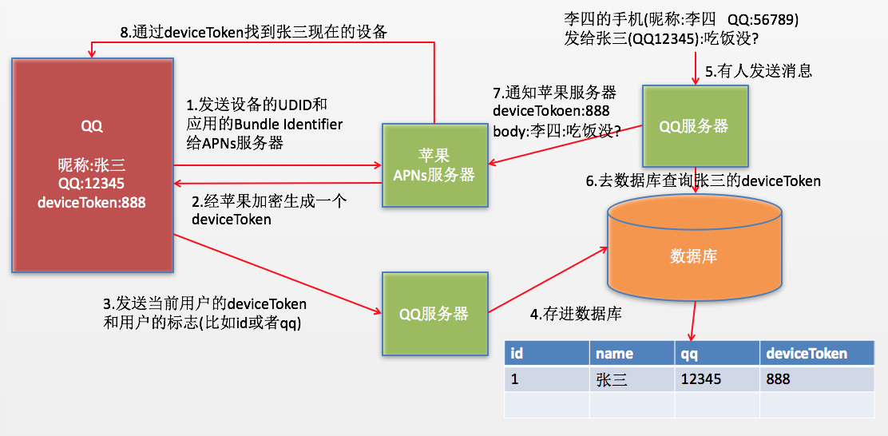

# 推送通知

## 简介

1.iOS中提供了2种推送通知

- 本地推送通知（Local Notification）
- 远程推送通知（Remote Notification）

2.作用 ：可以让不在前台运行的app，告知用户app内部发生了什么事情

3.呈现效果

- 在屏幕顶部显示一块横幅（显示具体内容）
- 在屏幕中间弹出一个UIAlertView（显示具体内容）
- 在锁屏界面显示一块横幅（锁屏状态下，显示具体内容）
- 更新app图标的数字（说明新内容的数量）
- 播放音效（提醒作用）

4.使用细节

- 发出推送通知时，如果当前程序正运行在前台，那么推送通知就不会被呈现出来
- 点击推送通知后，默认会自动打开发出推送通知的app
- 不管app打开还是关闭，推送通知都能如期发出

## 本地推送通知

1.简介：不需要联网就能发出的推送通知（不需要服务器的支持）

2.使用场景

- 常用来**定时提醒**用户完成一些任务

3.如何发出本地推送通知

```objc
// 1.创建本地推送通知对象
UILocalNotification *ln = [[UILocalNotification alloc] init];

// 2.设置本地推送通知属性
// 推送通知的触发时间（何时发出推送通知）
@property(nonatomic,copy) NSDate *fireDate;

// 推送通知的具体内容
@property(nonatomic,copy) NSString *alertBody;

// 在锁屏时显示的动作标题（完整标题：“滑动来” + alertAction）
@property(nonatomic,copy) NSString *alertAction;

// 音效文件名
@property(nonatomic,copy) NSString *soundName;

// app图标数字
@property(nonatomic) NSInteger applicationIconBadgeNumber;

// 3. 调度本地推送通知（调度完毕后，推送通知会在特地时间fireDate发出）
[[UIApplication sharedApplication] scheduleLocalNotification:ln];

// 获得被调度(定制)的所有本地推送通知
@property(nonatomic,copy) NSArray *scheduledLocalNotifications;
//（已经发出且过期的推送通知就算调度结束，会自动从这个数组中移除）

// 取消调度本地推送通知
- (void)cancelLocalNotification:(UILocalNotification *)notification;
- (void)cancelAllLocalNotifications;

// 立即发出本地推送通知
- (void)presentLocalNotificationNow:(UILocalNotification *)notification;

// 4.其他属性
// 每隔多久重复发一次推送通知
@property(nonatomic) NSCalendarUnit repeatInterval;

// 点击推送通知打开app时显示的启动图片
@property(nonatomic,copy) NSString *alertLaunchImage;

// 附加的额外信息
@property(nonatomic,copy) NSDictionary *userInfo;

// 时区
@property(nonatomic,copy) NSTimeZone *timeZone;
//（一般设置为[NSTimeZone defaultTimeZone] ，跟随手机的时区）

```

4.点击本地推送通知(自动打开app)

- app并没有关闭，一直隐藏在后台

	- 让app进入前台，并会调用AppDelegate的下面方法（并非重新启动app）
	
	```objc
	 -(void)application:(UIApplication *)application didReceiveLocalNotification:(UILocalNotification *)notification;
	```
- app已经被关闭（进程已死）

	- 启动app，启动完毕会调用AppDelegate的下面方法
	
	```objc
	-(BOOL)application:(UIApplication *)application didFinishLaunchingWithOptions:(NSDictionary *)launchOptions;
	```
	- launchOptions参数通过UIApplicationLaunchOptionsLocalNotificationKey取出本地推送通知对象

5.iOS8.0的变化

- 在iOS 8.0中，如果要使用本地通知，需要得到用户的许可
- 在didFinishLaunchingWithOptions方法中添加如下代码：

```objc
UIUserNotificationSettings *settings = [UIUserNotificationSettings settingsForTypes:UIUserNotificationTypeBadge | UIUserNotificationTypeSound | UIUserNotificationTypeAlert categories:nil];

[application registerUserNotificationSettings:settings];
```

## 远程推送通知

1.简介

- 从远程服务器推送给客户端的通知（需要联网）
- 远程推送服务，又称为**APNs**（Apple Push Notification Services）

2.作用

- 传统获取数据的局限性：只要用户关闭了app，就无法跟app的服务器沟通，无法从服务器上获得最新的数据内容
- 远程推送通知可以解决以上问题：不管用户打开还是关闭app，只要**联网**了，都能接收到服务器推送的远程通知

3.使用须知：所有的苹果设备，在**联网**状态下，都会与**苹果的服务器建立长连接**

- 什么是长连接：只要联网了，就一直建立连接

- 长连接的作用：时间校准，系统升级，查找我的iPhone

- 长连接的好处：数据传输速度快，数据保持最新状态


### iOS端的实现

1.**开发**iOS程序的推送功能

- 注册远程推送通知

	```objc
	// 一般在App启动完毕后就马上注册
	- (BOOL)application:(UIApplication *)application didFinishLaunchingWithOptions:(NSDictionary *)launchOptions
{
    	// 注册远程通知
       UIRemoteNotificationType type = UIRemoteNotificationTypeAlert | UIRemoteNotificationTypeBadge | UIRemoteNotificationTypeSound;
   		 [application registerForRemoteNotificationTypes:type];
   		 return YES;
	}
	```
- 请求苹果获得deviceToken
- 得到苹果返回的deviceToken

	```objc
	// 注册成功后会调用AppDelegate的下面方法，得到设备的deviceToken
   	- (void)application:(UIApplication *)application didRegisterForRemoteNotificationsWithDeviceToken:(NSData *)deviceToken
{
   		 NSLog(@"%@", deviceToken);
	}
	```
- 发送deviceToken给公司的服务器
- 监听用户对通知的点击

	```objc
	// app并没有关闭，一直隐藏在后台
 	// 让app进入前台，并会调用AppDelegate的下面方法（并非重新启动app）
	- (void)application:(UIApplication *)application didReceiveRemoteNotification:(NSDictionary *)userInfo;

	// app已经被关闭（进程已死）
	// 启动app，启动完毕会调用AppDelegate的下面方法
	- (BOOL)application:(UIApplication *)application didFinishLaunchingWithOptions:(NSDictionary *)launchOptions;
	// launchOptions参数通过UIApplicationLaunchOptionsRemoteNotificationKey取出服务器返回的字典内容
	```

2.**调试**iOS的远程推送功能, 必备条件:

- 真机
- 调试推送需要的证书文件
	- aps_development.cer : 某台电脑就能调试某个app的推送服务
	- iphone5_qq.mobileprovision : 某台电脑就能利用某台设备调试某个程序
- 配置证书文件
	- 1.创建App ID （说明**哪个App**需要使用推送服务，全称）
	- 2.为App ID创建APNs SSL调试/发布证书（要在**哪台电脑**上调试/发布具有推送服务的App）
		- 最终得到2个APNs SSL证书
			- APNs Development iOS：真机调试用的证书
			- APNs Production iOS：发布程序用的证书
 	
	- 3.生成描述文件（**哪台设备**要在**哪台电脑**上调试**哪个程序**）
	- 4.安装
		- 最终会得到3个文件
			- aps_development.cer：真机调试用的
			- aps_production.cer：发布程序用的
			- netease_news_iphone5_home.mobileprovision：描述文件

			建议：先安装cer文件，再安装mobileprovision文件
	 

3.**发布**具有推送服务的app

- aps_production.cer : 如果发布的程序中包含了推送服务,就必须安装这个证书
- qq.mobileprovision  : 某台电脑就能发布某个程序
