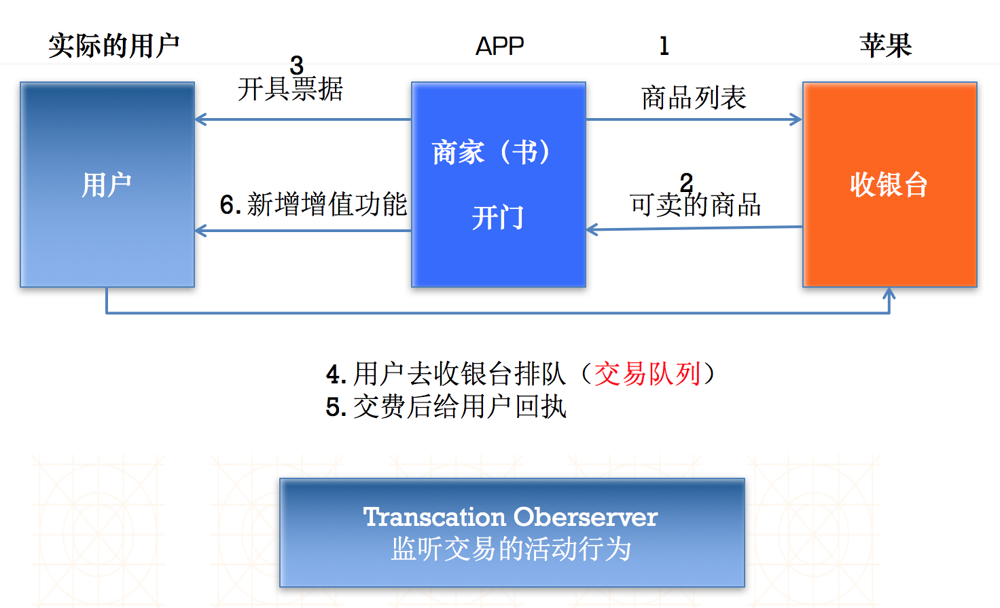

# 真机相关

## 一、真机调试

1.开发者账号的购买

- 个人：$99（￥688）
- 企业：$99
	- 申请复杂，需要“邓白氏”认证，可以确认企业是合法有效的
	- 可以管理团队开发 
- 商业：$299
	- 需要“邓白氏”认证
	- 开发的应用，不能够上架（不经过苹果的审核）
	- 专门给**企业级**用户定制应用程序使用

2.配置一些证书相关的内容

- 生成cer证书：cer是一个跟电脑相关联的证书文件，让电脑具备真机调试的功能
- 添加App ID：决定哪个应用程序可以被调试
- 注册真机设备Devices：决定哪台设备需要做真机调试
- 生成MobileProvision描述文件：结合前三者生成一个手机规定文件
- 导入cer、MobileProvision文件

## 二、发布程序

1.写好程序

2.让电脑具有发布哪个程序的能力（cer / APP ID / 描述文件）

3.配置和应用程序相关的信息

4.上传应用程序

注意:为了保证应用程序顺利通过上架，在做最后的提交之前，最好做以下两件事情：

- CMD+SHIFT+B静态内存分析：最基本地检查一下是否存在**内存泄露或者代码**问题
- 真机测试：这一点很重要，有些应用使用到第三方的静态库，但是项目中仅包含了模拟器的.a文件，这是无法提交的

## 三、内购

### 简介

1.通过苹果赚钱方式

- 直接收费（与国内大部分用户的消费习惯相悖）
- 广告
	- O2O -> Online推广 & Offline交易，闭环
- **内购**：应用程序本身的增值产品，游戏装备，应用程序中增值功能同样可以内购
	- 三（苹果）七（开发商）开 
- **第三方支付**

2.内购的五种产品类别

- 非消耗品（Nonconsumable）：一旦购买，终身拥有
	- 指的是在游戏中一次性购买并拥有永久访问权的物品或服务。非消耗品物品可以被用户再次下载，并且能够在用户的所有设备上共享
- 消耗品（Consumable）：买了就用，用了就没
	- 消耗品购买不可被再次下载，根据其特点，消耗品**不能在用户的设备之间跨设备使用**，除非自定义服务在用户的账号之间共享这些信息

- 以下三种类别在iBooks中使用，目前iBooks不支持大陆市场（ISBN：每本书的一个ID）
	- 免费订阅（Free subscriptions）
	- 自动续费订阅（Auto-renewing subscriptions）
	- 非自动续费订阅（Nonrenewing subscriptions）

### 具体实现

1.配置一个明确的APP ID

2.配置内购相关的内容

- 配置内购项目
- 配置测试账号
- 配置银行信息

3.内购的流程（导入**StoreKit**框架）

- 获取想卖商品的ProductID（服务器）--> NSSet
- 请求可卖的商品（SKProductRequest）
	- 实例化请求时，必须指定**有效的identifiers集合**（确保提交的内购商品真的通过了苹果的审批，处于可用状态） 

	```objc
	// 实例化产品请求
	SKProductsRequest *request = [[SKProductsRequest alloc]initWithProductIdentifiers:identifiers];
	// 设置代理
	[request setDelegate:self];
	// 启动请求
	[request start];
	```

- 代理方法（SKProductResponse --> products --> SKProduct）

	```objc
	// 获取准确可用产品集合
	- (void)productsRequest:(SKProductsRequest *)request didReceiveResponse:(SKProductsResponse *)response
	
	// 发起交易需要使用SKProduct对象,使用字典记录所有可用的商品
	NSMutableDictionary *_productsDict;
	```

- 创建票据 [SKPayment paymentWithProduct:product]
- 将票据加入交易队列 [[SKPaymentQueue defaultQueue] addPayment:payment]
- 添加交易观察者对象

	```objc
	[[SKPaymentQueue defaultQueue]addTransactionObserver:sharedInstance];
	```

- 监听交易状态 SKPaymentTransaction --> transactionState

	```objc
	- (void)paymentQueue:(SKPaymentQueue *)queue updatedTransactions:(NSArray *)transactions {
   		for (SKPaymentTransaction *transaction in transactions) {
        	// 购买完成
         if (transaction.transactionState == SKPaymentTransactionStatePurchased) {
            NSLog(@"购买完成 %@", transaction.payment.productIdentifier);

            [queue finishTransaction:transaction];
       	 } else if (transaction.transactionState == SKPaymentTransactionStateFailed) {
            if (transaction.error.code != SKErrorPaymentCancelled) {
                NSLog(@"交易失败： %@", transaction.error.localizedDescription);
            }
     	   }
   		 }
}
	```

- 恢复购买（针对非消耗品） [[SKPaymentQueue defaultQueue] restoreCompletedTransactions];
 



## 四、广告

- 广告收益三七开

- 添加 iAd.framework 框架
- 添加 ADBannerView 视图，并设置代理方法
- 广告条加载完成之前最好隐藏

```objc
- (void)bannerViewDidLoadAd:(ADBannerView *)banner {
    self.bannerBottomConstraint.constant = 20.0;    
    [UIView animateWithDuration:0.5 animations:^{
        [self.view layoutIfNeeded];
    }];    
    NSLog(@"加载广告成功");
}
- (void)bannerView:(ADBannerView *)banner didFailToReceiveAdWithError:(NSError *)error {
    NSLog(@"加载广告失败 %@", error);
}

```

## 五、测试打包

1.写好程序

2.让电脑具有打包某一个程序的能力（cer、APP ID、描述文件）
