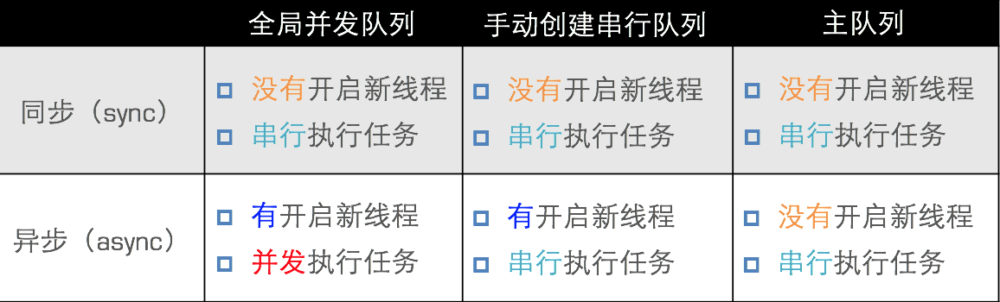

# GCD

## 简介

1.什么是GCD   

- 全称是Grand Central Dispatch，可译为“牛逼的中枢调度器”
- 纯C语言，提供了非常多强大的函数

2.优势

- GCD是苹果公司为多核的并行运算提出的解决方案
- GCD会自动利用更多的CPU内核（比如双核、四核）
- GCD会自动管理线程的生命周期（创建线程、调度任务、销毁线程）
- 程序员只需要告诉GCD想要执行什么任务，不需要编写任何线程管理代码

3.核心概念

- 任务：执行什么操作
- 队列：用来存放任务

4.使用步骤

- 定制任务
- 将任务添加到队列中
	- GCD会自动将队列中的任务取出，放到对应的线程中执行
   - 任务的取出遵循队列的FIFO原则：先进先出，后进后出


## 执行任务

1.执行任务

- 同步

		dispatch_sync(dispatch_queue_t queue, dispatch_block_t block);

- 异步

		dispatch_async(dispatch_queue_t queue, dispatch_block_t block);
- 同步和异步的区别
	- 同步：只能在**当前线程**中执行任务，**不具备**开启新线程的能力
	- 异步：可以在**新的线程**中执行任务，**具备**开启新线程的能力

2.队列的类型

- 并发队列（Concurrent Dispatch Queue）
	- 可以让多个任务**并发**（同时）执行（自动开启多个线程同时执行任务）
	- **并发**功能只有在**异步**（dispatch_async）函数下才有效
- 串行队列（Serial Dispatch Queue）
	- 一个任务执行完毕后，再执行下一个任务

3.同步、异步、并发、串行

- 同步和异步主要影响：能不能开启**新的线程**
- 并发和串行主要影响：任务的执行方式
	
	
## 创建队列

1.并发队列

- GCD默认已经提供了全局的并发队列，供整个应用使用，不需要手动创建

```objc
dispatch_queue_t dispatch_get_global_queue(
dispatch_queue_priority_t priority, // 队列的优先级
unsigned long flags); // 此参数暂时无用，用0即可
dispatch_queue_t queue = dispatch_get_global_queue(DISPATCH_QUEUE_PRIORITY_DEFAULT, 0); // 获得全局并发队列
```
- 全局并发队列的优先级

```objc
#define DISPATCH_QUEUE_PRIORITY_HIGH 2 // 高
#define DISPATCH_QUEUE_PRIORITY_DEFAULT 0 // 默认（中）
#define DISPATCH_QUEUE_PRIORITY_LOW (-2) // 低
#define DISPATCH_QUEUE_PRIORITY_BACKGROUND INT16_MIN // 后
```
2.串行队列

- 使用dispatch_queue_create函数创建串行队列

```objc
dispatch_queue_t
dispatch_queue_create(const char *label, // 队列名称 
dispatch_queue_attr_t attr); // 队列属性，一般用NULL即可
dispatch_queue_t queue = dispatch_queue_create("cn.itcast.queue", NULL); // 创建
dispatch_release(queue); // 非ARC需要释放手动创建的队列
```
- 使用主队列（跟主线程相关联的队列）
	- 主队列是GCD自带的一种特殊的串行队列
	- 放在主队列中的任务，都会放到主线程中执行
	
	```objc
	dispatch_queue_t queue = dispatch_get_main_queue();
	```

3.各种队列的执行效果



- 使用**sync**函数往**当前串行**队列中添加任务，会卡住当前的串行队列

## 线程间通信

- 从子线程回到主线程

```objc
dispatch_async(
dispatch_get_global_queue(DISPATCH_QUEUE_PRIORITY_DEFAULT, 0), ^{
    // 执行耗时的异步操作...
      dispatch_async(dispatch_get_main_queue(), ^{
        // 回到主线程，执行UI刷新操作
        });
});

```

## 其他用法

1.延时执行

- 调用NSObject的方法

	```objc
	[self performSelector:@selector(run) withObject:nil afterDelay:	2.0];
	// 2秒后再调用self的run方法
	```

- 使用GCD函数
	
	```objc
	dispatch_after(dispatch_time(DISPATCH_TIME_NOW, (int64_t)(2.0 * 	NSEC_PER_SEC)), dispatch_get_main_queue(), ^{
	    // 2秒后执行这里的代码...
	    // 执行方式取决于传入的队列
    
	});
	```
- 使用NSTimer

	```objc
	[NSTimer scheduledTimerWithTimeInterval:2.0 target:self selector:@selector(test) userInfo:nil repeats:NO];
	```
	
2.一次性代码

- 保证某段代码在程序运行过程中只被执行1次

	```objc
	static dispatch_once_t onceToken;
	dispatch_once(&onceToken, ^{
	    // 只执行1次的代码(这里面默认是线程安全的)
	});
	```
	
3.队列组

- 首先：分别异步执行2个耗时的操作
- 其次：等2个异步操作都执行完毕后，再回到主线程执行操作

	```objc
	dispatch_group_t group =  dispatch_group_create();
dispatch_group_async(group, dispatch_get_global_queue(DISPATCH_QUEUE_PRIORITY_DEFAULT, 0), ^{
    // 执行1个耗时的异步操作
});
dispatch_group_async(group, dispatch_get_global_queue(DISPATCH_QUEUE_PRIORITY_DEFAULT, 0), ^{
    // 执行1个耗时的异步操作
});
dispatch_group_notify(group, dispatch_get_main_queue(), ^{
    // 等前面的异步操作都执行完毕后，回到主线程...
});
	```

4.执行任务

- 前面的任务执行结束后它才执行，他执行完后他之后的任务才会执行
- queue不能是全局并发队列

	```objc
	dispatch_barrier_async(dispatch_queue_t  queue, ^{
            
        });
   ```
   
5.快速迭代
	
```objc
dispatch_apply(10, dispatch_get_global_queue(0, 0), ^(size_t) {
      // 执行10次代码，index顺序不确定
 });
```

## 单例模式

1.作用   

- 可以保证在程序运行过程，一个类只有一个实例，而且该实例易于供外界访问
从而方便地控制了实例个数，并节约系统资源

2.使用场合

- 在整个应用程序中，共享一份资源（这份资源只需要创建初始化1次）

3.用GCD实现单例模式

```objc
// .h文件
#define XMGSingletonH(name) + (instancetype)shared##name;

// .m文件
#define XMGSingletonM(name) \
static id _instance; \
 \
+ (instancetype)allocWithZone:(struct _NSZone *)zone \
{ \
    static dispatch_once_t onceToken; \
    dispatch_once(&onceToken, ^{ \
        _instance = [super allocWithZone:zone]; \
    }); \
    return _instance; \
} \
 \
+ (instancetype)shared##name \
{ \
    static dispatch_once_t onceToken; \
    dispatch_once(&onceToken, ^{ \
        _instance = [[self alloc] init]; \
    }); \
    return _instance; \
} \
 \
- (id)copyWithZone:(NSZone *)zone \
{ \
    return _instance; \
}
```

4.ARC中，单例模式的实现(不常用)

- 在.m中保留一个全局的static的实例
	
	```objc
	static id _instance;
	```
- 重写allocWithZone:方法，在这里创建唯一的实例（注意线程安全）

	```objc
	+ (id)allocWithZone:(struct _NSZone *)zone
	{
  	  @synchronized(self) {
        if (!_instance) {
            _instance = [super allocWithZone:zone];
        }
   	 }
   	 return _instance;
	}
	```
	
- 提供1个类方法让外界访问唯一的实例

	```objc
	+ (instancetype)sharedSoundTool
	{
 	   @synchronized(self) {
        if (!_instance) {
            _instance = [[self alloc] init];
       	 }
    	}
 	   return _instance;
	}
	```
	
- 实现copyWithZone:方法

	```objc
	- (id)copyWithZone:(struct _NSZone *)zone
	{
  		  return _instance;
	}
	```