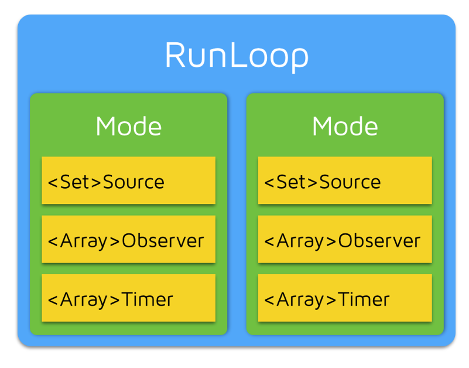
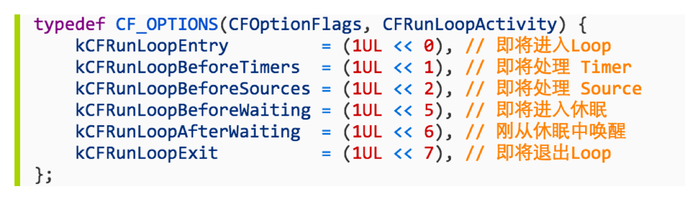
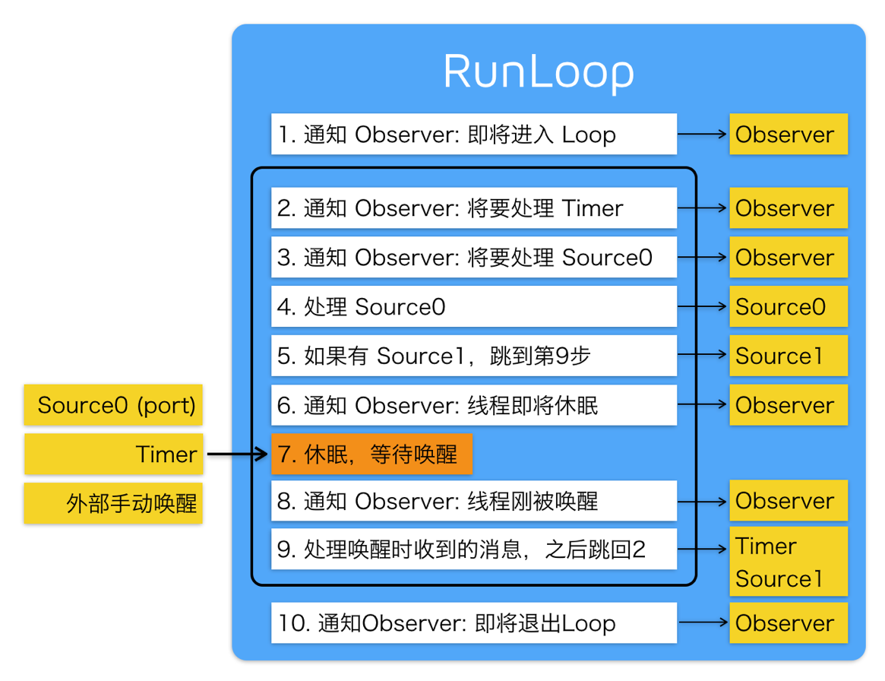

# RunLoop

## 简介

1.什么是RunLoop

- 简单理解，运行循环

2.基本作用

- 保持程序的持续运行
- 处理App中的各种事件（比如触摸事件、定时器事件、Selector事件）
- 节省CPU资源，提高程序性能：该做事时做事，该休息时休息

3.main函数中的RunLoop

- UIApplicationMain函数内部就启动了一个RunLoop
- 所以UIApplicationMain函数一直没有返回，保持了程序的持续运行
- 这个默认启动的RunLoop是跟**主线程**相关联的

## RunLoop对象

1.iOS中有2套API来访问和使用RunLoop

- Foundation ： NSRunLoop
- Core Foundation ： CFRunLoopRef （开源）

	 - CF的内存管理（Core Foundation）
    	- 1.凡是带有Create、Copy、Retain等字眼的函数，创建出来的对象，都需要在最后做一次release,比如CFRunLoopObserverCreate
    	- 2.release函数：CFRelease(对象);
	

> NSRunLoop和CFRunLoopRef都代表着RunLoop对象   
> NSRunLoop是基于CFRunLoopRef的一层OC包装

2.RunLoop与线程

- 每条**线程**都有**唯一**的一个与之对应的**RunLoop对象**
- 主线程的RunLoop已经自动创建好了，**子线程**的RunLoop需要**主动创建**
- RunLoop在第一次获取时创建（懒加载），在**线程结束时销毁**

3.获得RunLoop对象

```objc
// Foundation
[NSRunLoop currentRunLoop]; // 获得当前线程的RunLoop对象
[NSRunLoop mainRunLoop]; // 获得主线程的RunLoop对象

// Core Foundation
CFRunLoopGetCurrent(); // 获得当前线程的RunLoop对象
CFRunLoopGetMain(); // 获得主线程的RunLoop对象
```

## RunLoop相关类

1.简介

- Core Foundation中关于RunLoop的5个类
	- CFRunLoopRef
	- CFRunLoopModeRef
	- CFRunLoopSourceRef
	- CFRunLoopTimerRef
	- CFRunLoopObserverRef

	
	
2.CFRunLoopModeRef

- CFRunLoopModeRef 代表 RunLoop 的**运行模式**
	- 一个 RunLoop 包含若干个 Mode，每个Mode又包含若干个Source/Timer/Observer
	- 每次 RunLoop 启动时，只能指定其中一个 Mode，这个 Mode 被称作 CurrentMode
	- 如果需要切换 Mode，只能**退出Loop，再重新指定一个Mode**进入
	- 这样做主要是为了**分隔开不同组的Source/Timer/Observer**，让其互不影响
	
- 系统默认注册了5个Mode:
	- **kCFRunLoopDefaultMode**：App的默认Mode，通常主线程是在这个Mode下运行
	- **UITrackingRunLoopMode**：界面跟踪 Mode，用于 ScrollView 追踪触摸滑动，保证界面滑动时不受其他 Mode 影响
	- UIInitializationRunLoopMode: 在刚启动 App 时第进入的第一个 Mode，启动完成后就不再使用
	- GSEventReceiveRunLoopMode: 接受系统事件的内部 Mode，通常用不到
	- **kCFRunLoopCommonModes**: 这是一个占位用的Mode，不是一种真正的Mode

3.CFRunLoopSourceRef(事件源)

- Source0：非基于Port的
- Source1：基于Port的

4.CFRunLoopTimerRef

- 基于时间的触发器
- 基本上说的就是NSTimer，受RunLoop的Mode影响
- GCD的定时器不受RunLoop的Mode影响
5.CFRunLoopObserverRef

- 观察者，能够监听RunLoop的状态改变
- 可监听的时间点

	
	
## RunLoop处理逻辑

- 每次运行RunLoop，线程的RunLoop会自动处理之前未处理的消息，并通知相应的观察者，具体顺序如下：

0.判断当前mode下有没有任务，如果没有，直接跳出   
1.通知观察者RunLoop已经启动   
2.通知观察者任何即将要开始的定时器    
3.通知观察者任何即将启动的非基于端口的源    
4.启动任何准备好的非基于端口的源    
5.如果基于端口的源准备好并处于等待状态，立即启动；并进入步骤9    
6.通知观察者线程进入休眠    
7.将线程置于休眠直到任一下面的事件发生    

- 某一事件到达基于端口的源
- 定时器启动
- RunLoop设置的时间已经超时
- RunLoop被显式唤醒

8.通知观察者线程将被唤醒   
9.处理未处理的事件

- 如果用户定义的定时器启动，处理定时器事件并重启RunLoop；进入步骤2   
- 如果输入源启动，传递相应的消息
- 如果RunLoop被显式唤醒，而且时间还没超时，重启RunLoop；进入步骤2 

10.通知观察者RunLoop结束



## RunLoop应用

- NSTimer
- ImageView显示
- PerformSelector
- 常驻线程
- 自动释放池

## 常见面试题

1.**什么是RunLoop**

- 从字面意思看，运行循环
- 内部是do - while 循环，在这个循环内部不断的处理各种任务，比如 Source，Timer，Observer
- 一个线程对应一个RunLoop，主线程的RunLoop默认已经启动，子线程的RunLoop需要手动启动（调用run方法）
- RunLoop只能选择一个mode启动，如果当前mode没有任何Source，Timer，Observer，那么就直接退出RunLoop

2.**在开发过程中怎么使用RunLoop**

- 开启一个常驻线程（让一个子线程不进入消亡状态，等待其他线程发来消息，处理其他事件）
	- 在子线程中开启一个定时器
	- 在子线程中进行一些长期监控

- 可以控制定时器在特定模式下运行 
- 可以让某些事件（行为，任务）在特定模式下执行
- 可以添加Observer监听RunLoop的状态，比如监听点击事件的处理（在所有点击事件之前做一些事情）

3.**自动释放池什么时候释放**

- RunLoop睡眠之前释放（kCFRunLoopBeforeWaiting）