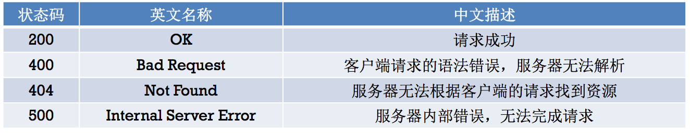

# 网络基础及HTTP

## 基本概念

- 客户端（Client）：移动应用（iOS、android等应用）

- 服务器（Server）：为客户端提供服务、提供数据、提供资源的机器
	- 远程服务器
		- 别名：**外网**服务器、**正式**服务器
		- 使用阶段：应用**上线**后使用的服务器
		- 使用人群：供全体用户使用
		- 速度：取决于服务器的性能、用户的网速
	- 本地服务器
		- 别名：**内网**服务器、**测试**服务器
		- 使用阶段：应用处于**开发、测试**阶段使用的服务器
		- 使用人群：仅供公司内部的开发人员、测试人员使用
		- 速度：由于是**局域网**，所以速度飞快，有助于提高开发测试效率

- 请求（Request）：客户端向服务器索取数据的一种行为

- 响应（Response）：服务器对客户端的请求做出的反应，一般指返回数据给客户端

## URL

- 什么是URL

	- URL的全称是Uniform Resource Locator（统一资源定位符）
	- 通过1个URL，能找到互联网上唯一的1个资源
	- URL就是资源的地址、位置，互联网上的每个资源都有一个唯一的URL
	
- URL的基本格式 = **协议://主机地址/路径**

	- 协议：不同的协议，代表着不同的资源查找方式、资源传输方式
	- 主机地址：存放资源的主机的IP地址（域名）
	- 路径：资源在主机中的具体位置

- URL中常见的协议

	- HTTP：**超文本传输协议**，访问的是远程的网络资源，格式是http://
	- file：访问的是本地计算机上的资源，格式是file://（不用加主机地址）
	- mailto：访问的是电子邮件地址，格式是mailto:
	- FTP：访问的是共享主机的文件资源，格式是ftp://

## HTTP

1.协议简介

- 规定客户端和服务器之间的数据传输格式
- 让客户端和服务器能有效地进行数据沟通

2.特点

- 简单快速：因为HTTP协议简单，所以HTTP服务器的程序规模小，因而通信速度很快
- 灵活：HTTP允许传输任意类型的数据
- HTTP1.0使用**非持续连接**：限制每次连接只处理一个请求，服务器对客户端的请求做出响应后，马上断开连接，这种方式可以节省传输时间

3.基本通信过程

- 请求：客户端向服务器索要数据

	- **请求行**：包含了**请求方法、请求资源路径、HTTP协议版本**
	
		```
		 GET /MJServer/resources/images/1.jpg HTTP/1.1 
		```
	- **请求头**：包含了**对客户端的环境描述、客户端请求的主机地址**等信息
		
		```
		Host: 192.168.1.105:8080 	// 客户端想访问的服务器主机地址
		User-Agent: Mozilla/5.0 (Macintosh; Intel Mac OS X 10.9) Firefox/30.0 // 客户端的类型，客户端的软件环境
		Accept: text/html, */* 	// 客户端所能接收的数据类型
		Accept-Language: zh-cn 	// 客户端的语言环境
		Accept-Encoding: gzip 	// 客户端支持的数据压缩格式
		```
	- **请求体**：客户端发给服务器的具体数据，比如文件数据


- 响应：服务器返回客户端相应的数据

	- **状态行**：包含了**HTTP协议版本、状态码、状态英文名称**
	
		```
		HTTP/1.1 200 OK 
		```
		
	- **响应头**：包含了对**服务器的描述、对返回数据的描述**

		```
		Server: Apache-Coyote/1.1 		// 服务器的类型
		Content-Type: image/jpeg 		// 返回数据的类型
		Content-Length: 56811 		// 返回数据的长度
		Date: Mon, 23 Jun 2014 12:54:52 GMT // 响应的时间
		```
	- **实体内容**：服务器返回给客户端的具体数据，比如文件数据



4.iOS中发送HTTP请求的方案

- 苹果原生（自带）

	- NSURLConnection：用法简单，最古老最经典最直接的一种方案
	- NSURLSession：iOS 7新出的技术，功能比NSURLConnection更加强大
	- CFNetwork：NSURL*的底层，纯C语言

- 第三方框架

	- ASIHttpRequest：外号“HTTP终结者”，功能极其强大，可惜早已停止更新
	- **AFNetworking**：简单易用，提供了基本够用的常用功能，维护和使用者多
	- MKNetworkKit：简单易用，产自三哥的故乡印度，维护和使用者少

5.GET 和 POST
 
- 在HTTP/1.1协议中，定义了**8种发送http请求**的方法

	- GET（查）、POST（改）、OPTIONS、HEAD、PUT（增）、DELETE（删）、TRACE、CONNECT、PATCH
	- 最常用的是GET和POST（实际上GET和POST都能办到增删改查）

- GET和POST的主要区别表现在**数据传递**上
	
	- GET
		- 在请求URL后面以?的形式跟上发给服务器的参数，多个参数之间用&隔开

		> 比如
http://ww.test.com/login?username=123&pwd=234&type=JSON

		- 由于浏览器和服务器对URL长度有限制，因此在URL后面附带的参数是有限制的，通常不能超过1KB

	- POST
		- 发给服务器的参数全部放在**请求体**中
		- 理论上，POST传递的数据量没有限制（具体还得看服务器的处理能力）

- 选择GET和POST的建议

	- 如果要传递大量数据，比如文件上传，只能用POST请求
	- GET的安全性比POST要差些，如果包含机密\敏感信息，建议用POST
	- 如果仅仅是索取数据（数据查询），建议使用GET
	- 如果是增加、修改、删除数据，建议使用POST

6.Http1.1和Http1.0的区别

- 长链接
	- http1.0：
	
		- 每对Request/Response都使用一个新的连接
		- 不支持断点续传，需要在request中增加”Connection： keep-alive“ header才能够支持
	- http1.1:
	
		- 默认使用长链接，在同一个tcp链接可以传送多个http请求和响应，同时也支持更多的请求头和响应头 
		- 允许同时在一条条件上发送多个请求，但是服务端必须按照接收请求的先后顺序发送应答包
		- host请求头字段，明确标识服务器上的web站点，http1.1还提供了身份认证、状态管理和cache缓存机制相关的头

7.http与https的区别

- http的url以http://开头，而https的url以https://开头 
- http是不安全的，而https是安全的
- http标准端口80，而https的标注端口是443
- 在OSI网络模型中，http工作与应用层，而https工作在传输层
- http无法加密，而https对传输的数据进行加密
- http无需证书，而https需要CA机构颁发的SSL证书