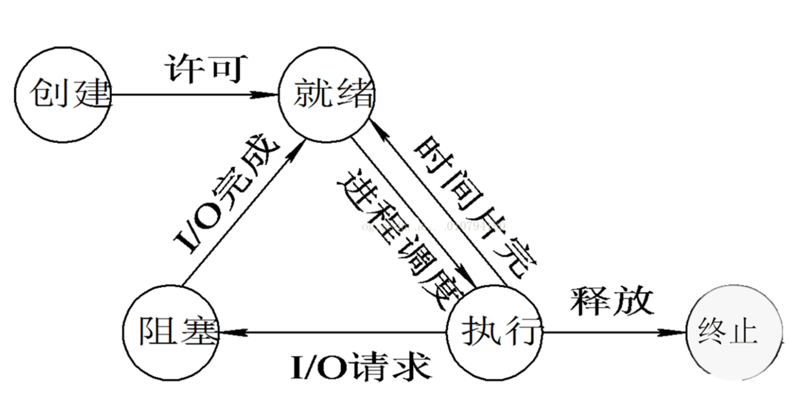
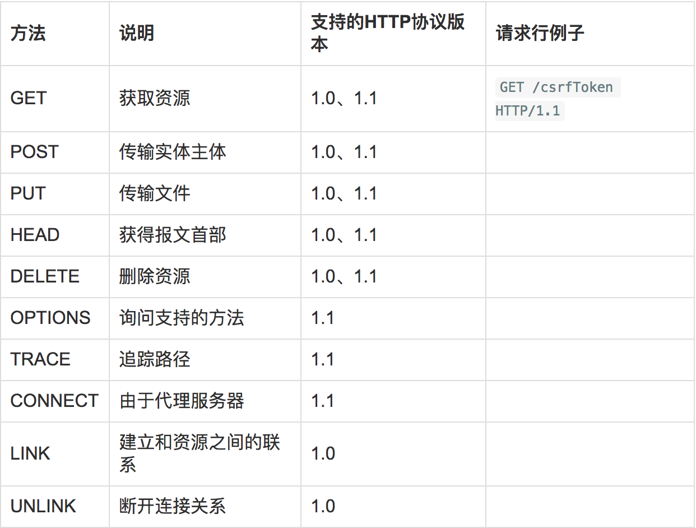
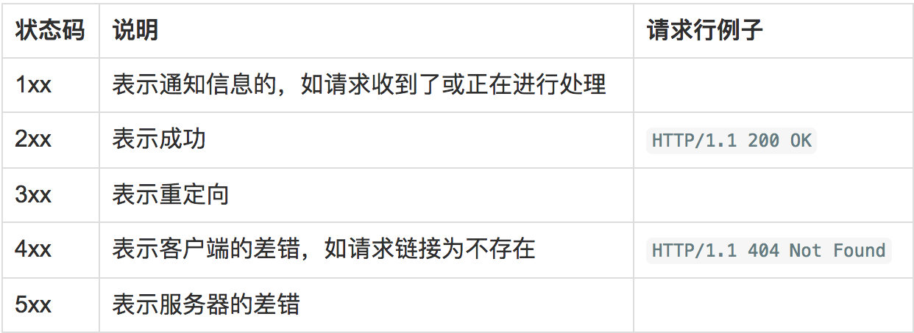
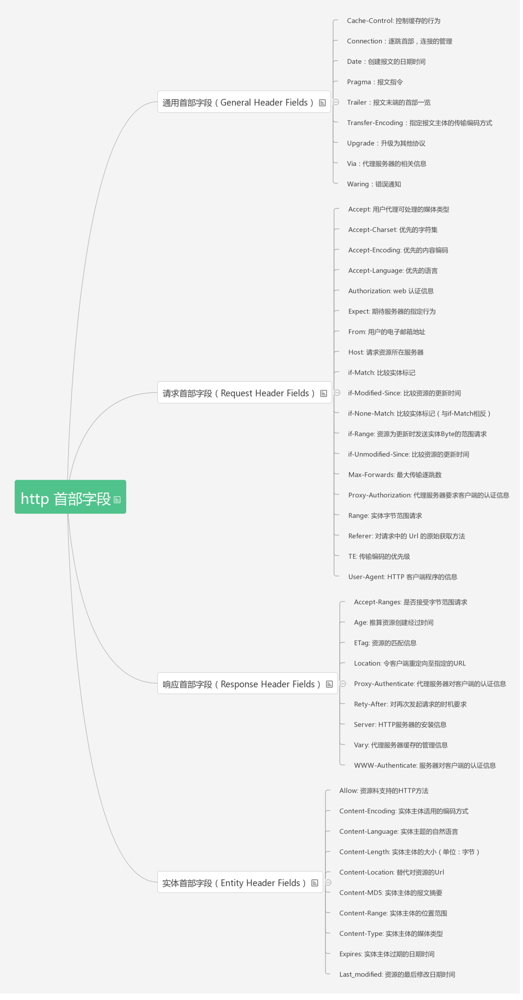

#面试准备
##目录

#####操作系统   
1. 进程和线程的区别。   
2. 死锁的必要条件，怎么处理死锁。   
3. Window内存管理方式：段存储，页存储，段页存储。   
4. 进程的几种状态。   
5. IPC几种通信方式。   
6. 什么是虚拟内存。   
7. 虚拟地址、逻辑地址、线性地址、物理地址的区别。   

#####TCP/IP   
1. OSI与TCP/IP各层的结构与功能，都有哪些协议。   
2. TCP与UDP的区别。   
3. TCP报文结构。   
4. TCP的三次握手与四次挥手过程，各个状态名称与含义，TIMEWAIT的作用。   
5. TCP拥塞控制。   
6. TCP滑动窗口与回退N针协议。   
7. Http的报文结构。   
8. Http的状态码含义。   
9. Http request的几种类型。   
10. Http1.1和Http1.0的区别   
11. Http怎么处理长连接。   
12. Cookie与Session的作用于原理。   
13. 电脑上访问一个网页，整个过程是怎么样的：DNS、HTTP、TCP、OSPF、IP、ARP。   
14. Ping的整个过程。ICMP报文是什么。   
15. C/S模式下使用socket通信，几个关键函数。   
16. IP地址分类。   
17. 路由器与交换机区别。   
 
#####数据结构与算法 
1. 链表与数组。 
2. 队列和栈，出栈与入栈。 
3. 链表的删除、插入、反向。 
4. 字符串操作。 
5. Hash表的hash函数，冲突解决方法有哪些。 
6. 各种排序：冒泡、选择、插入、希尔、归并、快排、堆排、桶排、基数的原理、平均时间复杂度、最坏时间复杂度、空间复杂度、是否稳定。 
7. 快排的partition函数与归并的Merge函数。 
8. 对冒泡与快排的改进。 
9. 二分查找，与变种二分查找。 
10. 二叉树、B+树、AVL树、红黑树、哈夫曼树。 
11. 二叉树的前中后续遍历：递归与非递归写法，层序遍历算法。 
12. 图的BFS与DFS算法，最小生成树prim算法与最短路径Dijkstra算法。 
13. KMP算法。 
14. 排列组合问题。 
15. 动态规划、贪心算法、分治算法。（一般不会问到） 
16. 大数据处理：类似10亿条数据找出最大的1000个数....

##操作系统
####1. 进程和线程的区别。

- 定义
	- 进程：是具有一定独立功能的程序、它是系统进行**资源分配和调度的一个独立单位**，也就是说进程是可以独立运行的一段程序。 
	- 线程：进程的一个实体，是**CPU调度和分派的基本单位**，他是比进程更小的能独立运行的基本单位，线程自己基本上**不拥有系统资源**。在运行时，只是暂用一些计数器、寄存器和栈。
- 他们之间的关系   
	- 一个线程只能属于一个进程，而一个进程可以有多个线程，但至少有一个线程（通常说的**主线程**）。 
	- 资源分配给进程，同一进程的所有线程共享该进程的所有资源。    
	- 线程在执行过程中，需要协作同步。不同进程的线程间要利用消息通信的办法实现同步。    
	- **处理机分给线程**，即真正在处理机上运行的是线程。  
- 区别    
	- 调度：线程作为**调度和分配**的基本单位，进程作为**拥有资源**的基本单位。    
	- 并发性：不仅进程之间可以并发执行，同一个进程的多个线程之间也可以并发执行。    
	- 拥有资源：进程是**拥有资源**的一个独立单位，线程不拥有系统资源，但可以**访问隶属于进程的资源**。

> 作者：榴莲艺声      [原文链接](https://www.zhihu.com/question/21535820/answer/22915780)     来源：知乎
		
####2. 死锁的必要条件，怎么处理死锁。 
- 死锁 :是指两个或两个以上的进程在执行过程中,因争夺资源而造成的一种互相等待的现象,若无外力作用,它们都将无法推进下去

- 产生原因：
	- 系统资源不足。
	- 进程运行推进顺序不合适。
	- 资源分配不当等。
- 死锁的必要条件
	- 互斥条件：一个资源每次只能被一个进程使用。  
   	- 请求与保持条件：一个进程因请求资源而阻塞时，对已获得的资源保持不放。  
   	- 不剥夺条件:进程已获得的资源，在末使用完之前，不能强行剥夺。  
  	- 循环等待条件:若干进程之间形成一种头尾相接的循环等待资源关系。
- 死锁的解除与预防：
	- 确定资源的合理分配算法，避免进程永久占据系统资源。
	- 防止进程在处于等待状态的情况下占用资源。
  	
> [原文链接](<a href="https://www.nowcoder.com/questionTerminal/09b51b00891543d6b08ace80c0704b01">https://www.nowcoder.com/questionTerminal/09b51b00891543d6b08ace80c0704b01</a>)    来源：牛客网

####3. Window内存管理方式：段存储，页存储，段页存储。 

####4. 进程的几种状态。 
- 就绪(Ready)状态：当进程已分配到除CPU以外的所有必要资源后，只要再获得CPU，便可立即执行，进程这时的状态称为就绪状态。在一个系统中处于就绪状态的进程可能有多个，通常将它们排成一个队列，称为就绪队列。 
- 执行状态：进程已获得CPU，其程序正在执行。在单处理机系统中，只有一个进程处于执行状态； 在多处理机系统中，则有多个进程处于执行状态。
- 阻塞状态：正在执行的进程由于发生某事件而暂时无法继续执行时，便放弃处理机而处于暂停状态，亦即进程的执行受到阻塞，把这种暂停状态称为阻塞状态，有时也称为等待状态或封锁状态。致使进程阻塞的典型事件有：**请求I/O**，**申请缓冲空间**等。通常将这种处于阻塞状态的进程也排成一个队列。有的系统则根据阻塞原因的不同而把处于阻塞状态的进程排成多个队列。
- 挂起状态：
	- 终端用户的请求。
	- 父进程请求。
	- 负荷调节的需要。
	- 操作系统的需要。
- 创建状态
	- 为一个新进程创建PCB，并填写必要的管理信息.
	- 把该进程转入就绪状态并插入就绪队列之中。  
- 终止状态：等待操作系统进行善后处理，然后将其PCB清零，并将PCB空间返还系统。 

> [原文链接](http://www.jianshu.com/p/ac9ce2afd126)      来源：简书

####5. IPC几种通信方式（进程间通信）。 

####6. 什么是虚拟内存。
- 虚拟内存是计算机系统内存管理的一种技术。它使得应用程序认为它拥有连续的可用的内存（一个连续完整的地址空间），而实际上，它通常是被**分隔成多个物理内存碎片**，还有部分暂时存储在外部磁盘存储器上，在需要时进行数据交换。
- 与没有使用虚拟内存技术的系统相比，使用这种技术的系统使得大型程序的编写变得更容易，对真正的物理内存（例如RAM）的使用也更有效率。
 
####7. 虚拟地址、逻辑地址、线性地址、物理地址的区别。 

> 书籍：《深入理解现代操作系统》 

##TCP/IP 
####1. OSI与TCP/IP各层的结构与功能，都有哪些协议。
- OSI（Open System Interconnection，开放系统互连）七层网络模型
	- 各个层次的划分原则
		- 同一层中的各网络节点都有相同的层次结构，具有同样的功能。
		- 同一节点内相邻层之间通过接口（可以是逻辑接口）进行通信。
		- 七层结构中的每一层使用下一层提供的服务，并且向其上层提供服务。
		- 不同节点的同等层按照协议实现对等层之间的通信。 
	- 各层简介
		- 【1】物理层
			- 主要**定义物理设备标准**，如网线的接口类型、光纤的接口类型、各种传输介质的传输速率等。
			- 它的主要作用是**传输比特流**（就是由1、0转化为电流强弱来进行传输,到达目的地后在转化为1、0，也就是我们常说的数模转换与模数转换），这一层的数据叫做比特。  
 		- 【2】数据链路层
 			- 负责物理传输的准备。
 			- 作用：物理地址寻址、数据的成帧、流量控制、数据的检错、重发等。在这一层，数据的单位称为帧（frame）
 			- 协议的代表包括：SDLC、HDLC、PPP、STP、帧中继等。MAC地址和交换机在这一层。
 		- 【3】网络层
 			- 选择合适的网间路由和交换结点， 确保数据及时传送
 			 
####2. TCP与UDP的区别。 
####3. TCP报文结构。 
####4. TCP的三次握手与四次挥手过程，各个状态名称与含义，TIMEWAIT的作用。 
####5. TCP拥塞控制。 
####6. TCP滑动窗口与回退N针协议。 
####7. Http的报文结构。 
HTTP的这两种报文都由三部分组成：开始行、首部行、实体主体（在报文中，一般都不用这个字段）。

- 请求报文：从客户向服务器发送请求报文。
	- 开始行：也叫请求行，由 方法、[空格]、URL、[空格]、HTTP版本 组成。

		

- 响应报文：从服务端到客户的回答。
	- 开始行：也叫响应行，由 HTTP 版本、[空格]、状态码组成。

		
- 首部行
	- 是用来说明浏览器、服务器或报文主体的一些信息。
	- 可以有好几行，也可以不使用
	- 每个首部行都是由 首部字段名、[空格] 和 值 组成
	- 每个首部行在结束地方都有 CRLF（『回车』和『换行』符） 
	
	
	
####8. Http的状态码含义。 

- 200 OK：请求被成功处理，服务器会根据不同的请求方法返回结果。
- 204 No Content：服务器接收到的请求已经处理完毕，但是服务器不需要返回响应体.
- 206 Partial Content：客户端进行了范围请求，而服务器成功执行了这部分的GET请求。
- 301 Movied Permanently：永久性重定向。该状态码表示请求的资源已经被分配了新的URI，并且以后使用资源现在所指的URI。
	- HEAD：必须在响应头部Location字段中指明新的永久性的URI。
	- GET：除了有Location字段以外，还需要在响应体中附上永久性URI的超链接文本。
	- POST：客户端在发送POST请求，受到301响应之后，不应该自动跳转URI，应当让用户确认跳转。 
- 302 Found：临时性重定向。该状态码表示请求的资源已被分配了新的URI，希望用户本次能使用新的URI访问。
- 303 See Other：由于请求对应的资源存在另一个URI，应使用GET方法定向获取请求的资源。
	- 302是不会改变请求的方法，如果请求方法是POST的话，重定向的请求也应该是POST。
	- 而对于303，使用POST请求的话，重定向的请求应该是GET请求。
- 304 Not Modified：客户端发送附带条件请求时，服务器端允许请求访问资源，但未满足条件的情况。
- 307 Temporary Redirect：临时重定向。307状态码并不会指定客户端要用什么样的请求方法请求重定向地址。
- 400 Bad Request：表示该请求报文中存在语法错误，导致服务器无法理解该请求。客户端需要修改请求的内容后再次发送请求。
- 401 Unauthorized：发送的请求需要有通过HTTP认证的认证信息。返回含有401的响应，必须在头部包含WWW-Authenticate以指明服务器需要哪种方式的认证。
- 403 Forbidden：对请求资源的访问被服务器拒绝了。未获得文件系统的访问权限，访问权限出现某些问题，从未授权的发送源IP地址试图访问等情况。
- 404 Not Found：服务器上无法找到指定的资源。
- 500 Internal Server Error：服务器端在执行请求时发生了错误。
- 503 Service Unavailable：服务器暂时处于超负载或正在进行停机维护，现在无法处理请求。如果事先得知解除以上需要的时间，最好写入Retry-After首部字段再返回给客户端。

####9. Http request的几种类型。

 
####10. Http1.1和Http1.0的区别 及 http与https的区别
- Http1.1和Http1.0的区别
	- 长链接
		- http1.0：
			- 每对Request/Response都使用一个新的连接
			- 不支持断点续传，需要在request中增加”Connection： keep-alive“ header才能够支持
		- http1.1:
			- 默认使用长链接，在同一个tcp链接可以传送多个http请求和响应，同时也支持更多的请求头和响应头 
			- 允许同时在一条条件上发送多个请求，但是服务端必须按照接收请求的先后顺序发送应答包
			- host请求头字段，明确标识服务器上的web站点，http1.1还提供了身份认证、状态管理和cache缓存机制相关的头
			
- http与https的区别

	- http的url以http://开头，而https的url以https://开头 
	- http是不安全的，而https是安全的
	- http标准端口80，而https的标注端口是443
	- 在OSI网络模型中，http工作与应用层，而https工作在传输层
	- http无法加密，而https对传输的数据进行加密
	- http无需证书，而https需要CA机构颁发的SSL证书

####11. Http怎么处理长连接。 

- 在HTTP/1.0中，默认使用的是短连接。也就是说，浏览器和服务器每进行一次HTTP操作，就建立一次连接，但任务结束就中断连接。

- HTTP/1.1起，默认使用长连接，当一个网页打开完成后，客户端和服务器之间用于传输HTTP数据的 TCP连接不会关闭，如果客户端再次访问这个服务器上的网页，会继续使用这一条已经建立的连接。Keep-Alive不会永久保持连接，它有一个保持时间。

####12. Cookie与Session的作用与原理。 

- Cookie
	- 简介：某些网站为了辨别用户身份、进行session跟踪而储存在用户本地终端上的数据（通常经过加密）。由服务端生成的，发送给客户端。 保存在客户端。
	- 工作原理
		- 创建Cookie： 当用户第一次浏览某个使用Cookie的网站时，该网站的服务器会为该用户生成一个唯一的识别码（Cookie id），创建一个Cookie对象；默认情况下它是一个会话级别的cookie，存储在浏览器的内存中，用户退出浏览器之后被删除；将Cookie放入到HTTP响应报头，将Cookie插入到一个 Set-Cookie HTTP请求报头中；发送该HTTP响应报文。
		- 设置存储Cookie：浏览器收到该响应报文之后，根据报文头里的Set-Cookied特殊的指示，生成相应的Cookie，保存在客户端。该Cookie里面记录着用户当前的信息。
		- 发送Cookie：当用户再次访问该网站时，浏览器首先检查所有存储的Cookies，如果存在该网站的Cookie，则把该cookie附在请求资源的HTTP请求头上发送给服务器。
		- 读取Cookie：服务器接收到用户的HTTP请求报文之后，从报文头获取到该用户的Cookie，从里面找到所需要的东西。
	- 作用：在客户端存储用户访问网站的一些信息 
		- 记住密码，下次自动登录
		- 购物车功能
		- 记录用户浏览数据，进行商品（广告）推荐
- Session
	- 简介：Session代表服务器与浏览器的一次会话过程。Session 对象用来存储特定用户会话所需的信息。Session由服务端生成，保存在服务器中。
	- 工作原理
		- 创建Session：当用户访问到一个服务器，如果服务器启用Session，服务器就要为该用户创建一个Session。如果请求里包含了一个Session id，那服务器就按照这个id把这个Session在服务器的内存中查找出来，否则，新建session生成id，在本次响应中返回到客户端保存，而保存这个id的正是Cookie。
		- 使用Session：
	- 作用：在服务端存储用户和服务器会话的一些信息
		- 判断用户是否登录
		- 购物车功能
- 区别
	- 存放位置：Cookie保存在客户端，Session保存在服务端
	- 存取方式的不同：Cookie中只能保管ASCII字符串，而Session中能够存取任何类型的数据。
	- 安全性（隐私策略）的不同 ：Cookie存储在浏览器中，对客户端是可见的，客户端的一些程序可能会窥探、复制以至修正Cookie中的内容。而Session存储在服务器上，对客户端是透明的，不存在敏感信息泄露的风险。
	- 有效期上的不同 ：Cookie可以通过设置过期时间在浏览器保存很长时间，Session依赖于名为JSESSIONID的Cookie，关闭了浏览器（一次会话结束），该Session就会失效。
	- 对服务器造成的压力不同：Session是保管在服务器端的，每个用户都会产生一个Session。假如并发访问的用户十分多，会产生十分多的Session，耗费大量的内存。而Cookie保管在客户端，不占用服务器资源。假如并发阅读的用户十分多，Cookie是很好的选择。
	- 跨域支持上的不同 ：Cookie支持跨域名访问，例如将domain属性设置为“.baidu.com”，则以“.baidu.com”为后缀的一切域名均能够访问该Cookie。跨域名Cookie如今被普遍用在网络中。而Session则不会支持跨域名访问。Session仅在他所在的域名内有效。 

####13. 电脑上访问一个网页，整个过程是怎么样的：DNS、HTTP、TCP、OSPF、IP、ARP。 

浏览器先尝试从Host文件中获取网页对应的IP地址，如果不能，就使用DNS协议来获取IP。

- 获取网页IP：在DNS协议中，PC会向你的本地DNS服务器求助（一般是路由器），希望从本地**DNS服务器那里得到网页的IP**，如果得不到要向更高层次的DNS服务器求助，最终总能得到网页的IP。
- 建立TCP连接：在TCP协议中，**建立TCP需要与网页服务器握手三次**，先告诉服务器你要给服务器发东西（**SYN**），服务器应答并告诉你它也要给你发东西（**SYN、ACK**），然后你应答服务器（**ACK**）。 
- 给服务器发消息有个前提，你必须能成功地把消息发到服务器上。**IP协议指定了出发地（你的PC）和目的地（服务器）**；数据会经过一个又一个路由器，**OSPF决定了会经过那些路由器**（用一种叫路由算法的玩意，找出最佳路径）；**ARP协议决定了从一个路由器怎么传给下一个路由器，求下一个节点的地址**（我们不止是要目的地，还要中间节点的地址）。 
- **IP协议使用的是IP地址**，整个发送过程中只涉及出发地和目的地2个IP地址，而**ARP协议使用的是MAC地址**，整个发送过程中涉及到每一个节点的MAP地址 
- 建立了**TCP连接之后，用HTTP协议请求网页内容**：发送HTTP请求报文给服务器请求数据，请求成功收到服务器的回复，是HTML形式的文本。浏览器要能理解文本内容，并快速地渲染到屏幕上。

####14. Ping的整个过程。ICMP报文是什么。 

####15. C/S模式下使用socket通信，几个关键函数。 
####16. IP地址分类。 
####17. 路由器与交换机区别。 

> 网络其实大体分为两块，一个TCP协议，一个HTTP协议，只要把这两块以及相关协议搞清楚，一般问题不大。 

> 书籍：《TCP/IP协议族》 

##数据结构与算法 
####1. 链表与数组。 
####2. 队列和栈，出栈与入栈。 
####3. 链表的删除、插入、反向。 
####4. 字符串操作。 
####5. Hash表的hash函数，冲突解决方法有哪些。 
####6. 各种排序：冒泡、选择、插入、希尔、归并、快排、堆排、桶排、基数的原理、平均时间复杂度、最坏时间复杂度、空间复杂度、是否稳定。 

- 冒泡排序 （稳定）
	- 两两比较相邻记录的关键字,如果反序则交换
	- 最好的情况为O(n),最坏的情况是O(n^2)
	- 改进思路1：设置标志位，明显如果有一趟没有发生交换（flag = false)，说明排序已经完成
	- 改进思路2：记录一轮下来标记的最后位置，下次从头部遍历到这个位置就Ok
- 插入排序（稳定）
	- O(n^2）
- 选择排序 O(n^2) （稳定）
- 希尔排序：先将整个待排元素序列分割成若干子序列（由相隔某个“增量”的元素组成的）分别进行直接插入排序，然后依次缩减增量再进行排
序，待整个序列中的元素基本有序（增量足够小）时，再对全体元素进行一次直接插入排序（增量为1）。其时间复杂度为O(n^3/2)
- 归并排序：O(nlogn),把n个数看成n个有序的子序列，然后两两归并 （稳定）
- 堆排序： O(nlogn),
- 快速排序：O(nlogn) 最坏n^2

####7. 快排的partition函数与归并的Merge函数。 
####8. 对冒泡与快排的改进。 
####9. 二分查找，与变种二分查找。 
####10. 二叉树、B+树、AVL树、红黑树、哈夫曼树。 
####11. 二叉树的前中后续遍历：递归与非递归写法，层序遍历算法。 
####12. 图的BFS与DFS算法，最小生成树prim算法与最短路径Dijkstra算法。 
####13. KMP算法。 
####14. 排列组合问题。 
####15. 动态规划、贪心算法、分治算法。（一般不会问到） 
####16. 大数据处理：类似10亿条数据找出最大的1000个数...

> 书籍：《大话数据结构》《剑指offer》《编程之美》 

##写在最后
- 以上内容非原创，均来自于网络，本人只做整理
- 希望最后大家都能找到理想的工作